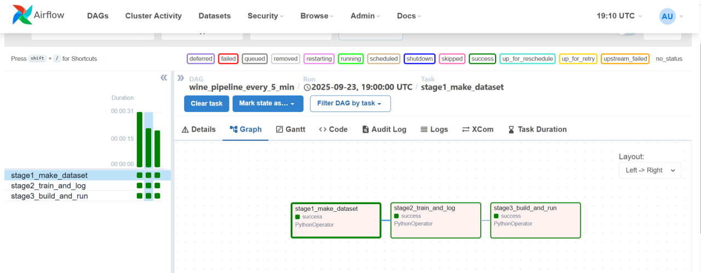
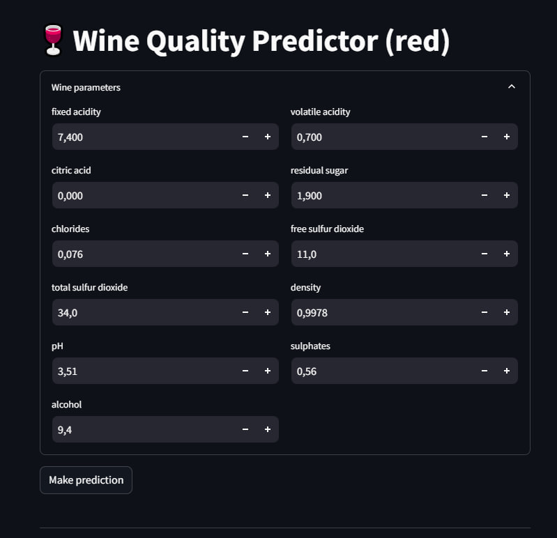

# Wine Quality ML Pipeline — Data → Model → Deployment

## 🚀 Quick Start

### Run via Airflow
```bash
cd services/airflow
docker compose up -d
```
Airflow UI → http://localhost:8080 (admin/admin)

Streamlit App UI → http://localhost:8501/

P.S. Please, wait couple of minutes if pages not loading.

---
# Project Schema
```bash 
/pmldl
|   app_ui.jpg                  # Screenshot of the Streamlit UI
|   docker-compose.yml          # Compose file to run API + Streamlit App (to start airflow with services, use another compose)
|   Dockerfile                  # Multi-stage build
|   pipeline_example.jpg        # Screenshot of Airflow pipeline run
|   README.md                   # Documentation itself
|   requirements.txt            # Dpendencies
|   
+---code
|   +---datasets
|   |       make_dataset.py     # Stage 1: data loading, cleaning, splitting
|   |       
|   +---deployment
|   |   |   deploy.py           # Stage 3: build and run Docker containers via Docker SDK
|   |   |   
|   |   +---api
|   |   |       main.py         # FastAPI service exposing /predict endpoint
|   |   |       
|   |   \---app
|   |           streamlit_app.py # Streamlit app UI (user inputs wine features, shows prediction)
|   |           
|   \---models
|           train_model.py      # Stage 2: feature processing, training, evaluation, model saving
|           
+---data
|   |   winequality-red.csv     # Raw dataset (red wine quality)
|   |   
|   \---processed
|           test.csv            # Processed test split (generated in Stage 1)
|           train.csv           # Processed train split (generated in Stage 1)
+---models
|       wine_model.pkl          # Trained model artifact (generated in Stage 2)
|       
\---services
    \---airflow
        |   docker-compose.yml  # Compose file for Airflow (!!! Use this to start Web UI + Scheduler !!!)
        |   
        \---dags
            |   pipeline.py     # Airflow DAG with 3 tasks: Stage1 → Stage2 → Stage3
```
---
# 📸 Screenshots

✅ Airflow DAG:



🎛️ Streamlit UI:



---

## ⚙️ Stages

### Stage 1 — Data Engineering
- Loads raw dataset (`data/winequality-red.csv`)
- Cleans missing values & removes outliers (IQR)
- Splits into train/test with stratification
- Outputs → `data/processed/train.csv` & `test.csv`

### Stage 2 — Model Engineering
- Pipeline: `StandardScaler` → `LinearRegression`
- Trains on train data, evaluates on test data
- Logs metrics (RMSE, R²) into **MLflow** (`mlruns/`)
- Saves model to `models/wine_model.pkl`

### Stage 3 — Deployment
- Builds Docker images from single `Dockerfile`:
  - `wine_api` (FastAPI) → port `8000`
  - `wine_app` (Streamlit) → port `8501`
- Runs containers in shared network

### Orchestration — Airflow
- DAG: `wine_pipeline_every_5_min`
- Three tasks: `stage1_make_dataset → stage2_train_and_log → stage3_build_and_run`
- Schedule: `*/5 * * * *`

---
